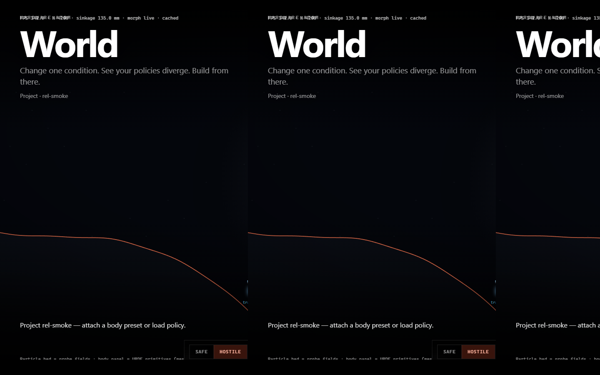
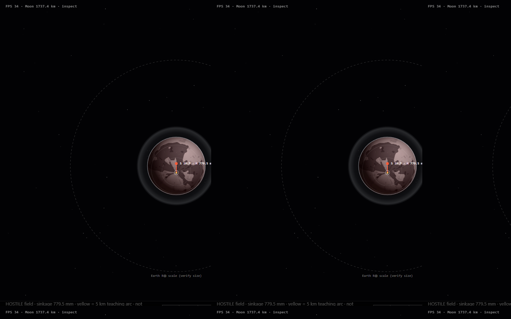

# HA Production Gate

**Physics before ship.** Dual world · sealed receipt · named ε · refuse bit — stranger-reproducible.

[](https://github.com/StanByriukov02/ha-production-gate/actions/workflows/ci.yml)
[](https://github.com/StanByriukov02/ha-production-gate/releases)
[](LICENSE)
[](https://github.com/StanByriukov02/ha-production-gate/commits/main)
[](https://github.com/StanByriukov02/ha-production-gate/issues)

[](crates/ha_physics_gate)
[](#why-this-physics)
[](START_HERE_PRODUCTION_GATE_V1.md)
[](#why-this-physics)

Most robot / autonomy / mission stacks still go **green** without a Dual world, without a sealed refuse, without named honesty on the physics claim.  
This gate makes that lie expensive — and the physics decision lives in **Rust**, not in a Python script that can soft-mint a PASS.

```text
ha-production-gate
→ PRODUCTION_GATE_RITUAL_PASS
```

---

## Why this physics

| Advantage | What it means |
|-----------|----------------|
| **Dual world** | Same stack · Safe ALLOW · Hostile REFUSE — condition change must burn |
| **Rust physics gate** | Bekker / env / apoptosis path: `ha-physics-gate` decides; Python is glue only |
| **Sealed runtime** | Kernel sealed inside HA Dual — not an IDE chat transcript |
| **Named ε** | Honesty cannot be upgraded by renaming the label |
| **Stranger reverify** | Kit + board another engineer can re-run outside your desk |
| **Refuse bit** | Hostile `current_allowed=false` — ship claim stops with a receipt |

You can still simulate elsewhere.  
What you do **not** get elsewhere for free: a shared, stranger-checkable **physics refuse** before production.

---

## What it looks like

Full desktop viewport (**1440×900**) — companion Start here desk. Not a cropped IDE pane.



**World** — change one condition · policies diverge · Hostile sinkage on Moon field



**Mission** — Dual on the globe · Safe vs Hostile sinkage Δ visible

Public clone core action remains the gate CLI. These frames are the physics surface humans work in.

---

## Languages on GitHub

GitHub’s language bar counts **bytes**, not importance. An early extract left ~2 MB Python orchestration + chip scripts next to ~0.3 MB Rust — so the bar lied.

This repo now:

- ships the **Rust physics cores** (`ha_physics_gate`, `universe_kinematic`, `ha_artifact_law`, `universe_scale`, `ha_iron_attestation`, energy/body/silicon)
- marks Python/scripts/fixtures as **Linguist-vendored** so the bar reflects the physics substance  
  (Python still ships and runs — glue only; oracle is Rust)

See [`.gitattributes`](.gitattributes).

---

## What you get when the gate runs

| You see | Meaning |
|---------|---------|
| Safe ALLOW | claim may proceed in the Safe Dual |
| Hostile REFUSE | same physics stack denies in Hostile |
| `sealed_in_ha_runtime=true` | OS lives in HA Dual |
| Named `epsilon` | no soft-mint label upgrade |
| Stranger kit | receipts outside the author’s desk |

---

## Quick start

**Foundation:** Rust physics bins (build these first).  
**Glue:** Python ≥ 3.11 for the ritual runner.  
**Also:** C compiler for `ha_silicon_fuse` (Windows: MSVC Build Tools).

```bash
git clone https://github.com/StanByriukov02/ha-production-gate.git
cd ha-production-gate

cargo build -p ha_physics_gate --release
cargo build -p ha_silicon_fuse --release
cargo build -p ha_energy_ledger --release
cargo build -p ha_body_identity --release
cargo build -p universe_kinematic --release --bin manipulator_kinematics_step

python -m venv .venv
# Windows: .venv\Scripts\activate
# Unix:    source .venv/bin/activate
pip install -e ".[smoke]"

ha-production-gate
```

Expect: `PRODUCTION_GATE_RITUAL_PASS` · board under `results/runtime/platform_loop/`.

Sample board: [`docs/examples/PRODUCTION_GATE_BOARD_SAMPLE.md`](docs/examples/PRODUCTION_GATE_BOARD_SAMPLE.md)

---

## Example board (abridged)

```text
════════════════════════════════════════════════════════════
  HA PRODUCTION GATE — before you ship
  verdict: PRODUCTION_GATE_RITUAL_PASS

  Ritual:  Dual · sealed receipt · named ε · refuse

  [PASS] F_dual_safe_allow_hostile_refuse
  [PASS] F_kernel_sealed_in_ha_runtime
  [PASS] F_named_epsilon_on_seal
  [PASS] F_hostile_current_refuse
  [PASS] F_physics_world_stack_complete
  [PASS] F_soft_mint_impossible
  [PASS] F_stranger_kit_reverify
  [PASS] F_ritual_is_one_command
════════════════════════════════════════════════════════════
```

---

## Who this is for

- Anyone building a robot who needs physics-honest ship confidence
- Robotics / sim engineers (ROS, Gazebo, Nav2, MoveIt world)
- Production engineers who want a pre-merge refuse habit
- People who want Dual visible in desk (World / Mission) **and** stranger-checkable in CLI

One face for every level.

---

## Honesty (without theater)

- Soft release · not field MEASURED · soft ≠ OTP
- Python orchestrates; **Rust owns the physics gate oracle**
- This surface is the public Production Gate — not the full private workshop

---

## Docs

| Doc | Role |
|-----|------|
| [`START_HERE_PRODUCTION_GATE_V1.md`](START_HERE_PRODUCTION_GATE_V1.md) | Engineer 30-second entry |
| [`docs/agent_workflow/PRODUCTION_GATE_RITUAL_V1.md`](docs/agent_workflow/PRODUCTION_GATE_RITUAL_V1.md) | Ritual canon |
| [`docs/agent_workflow/PHYSICS_OS_KERNEL_V0.md`](docs/agent_workflow/PHYSICS_OS_KERNEL_V0.md) | Kernel honesty ladder |

---

## Soft release pack

```bash
ha-release-engineer
# stages results/runtime/release_engineer/LATEST/
```

Ask: *if this gate disappeared tomorrow, would you lose a week of knowing?*

---

## Contributing

See [`CONTRIBUTING.md`](CONTRIBUTING.md).

## Security

See [`SECURITY.md`](SECURITY.md).

## License

Apache License 2.0 — see [`LICENSE`](LICENSE).

---

## Maintainers

Stanislav Byriukov — Hardware Atom / Production Gate

Regards,  
Stan
